# Auxilary Project using bash scripting to automate the addition of 20 users to a group on Linux

## run the script below to create a project folder and move into the folder

`mkdir Shell`

`cd Shell`

## create a csv file using the script below and open the file using the vim editor. Also include names of new users to be added to the group - in my case i've updated the csv file with some random names to be added to group developers

`touch names.csv`

`vim names.csv`

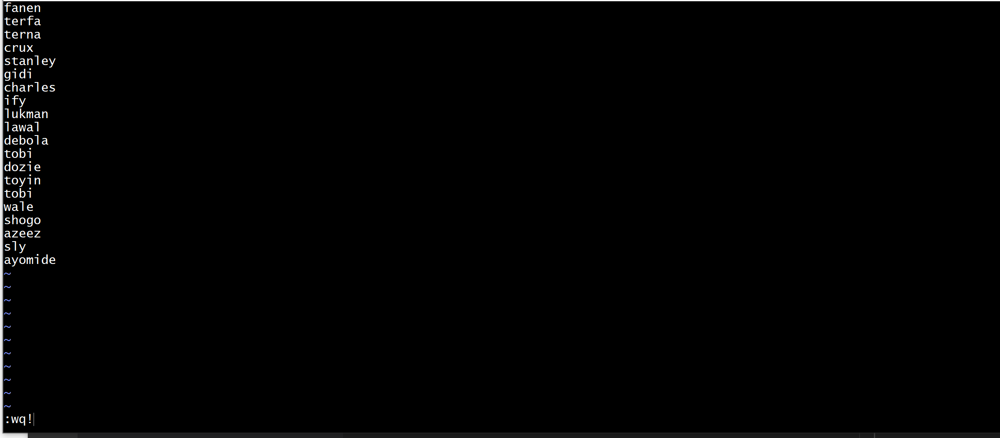

## create a bash script file to create a Group called developers if it does not exist using the script on the screenshot below or we can as well create the group using the scrip below

`sudo groupadd developers`

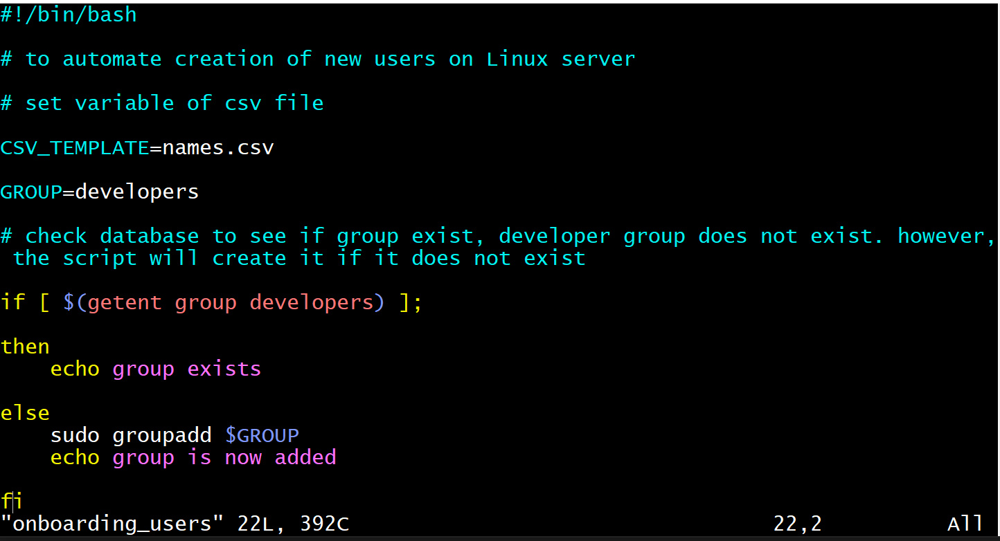

## script to check existence of a user before adding it to the system - the getend command can be used in the way below to test the case

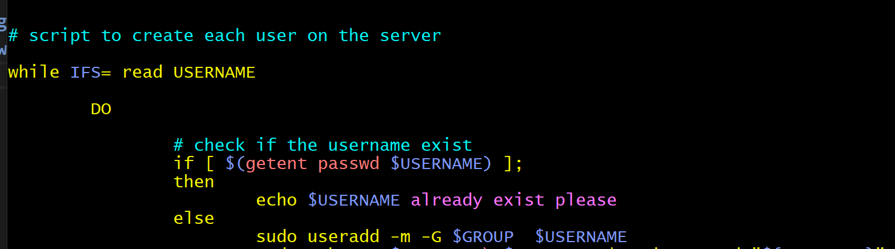

## Ensure user has a default home folder as well. update the script to include this clause. to automate this process, ensure that the folder exist or we can create it in the etc/skel folder that automatically moves files within it directory to all users home directory that exist within the Linux accounts DB

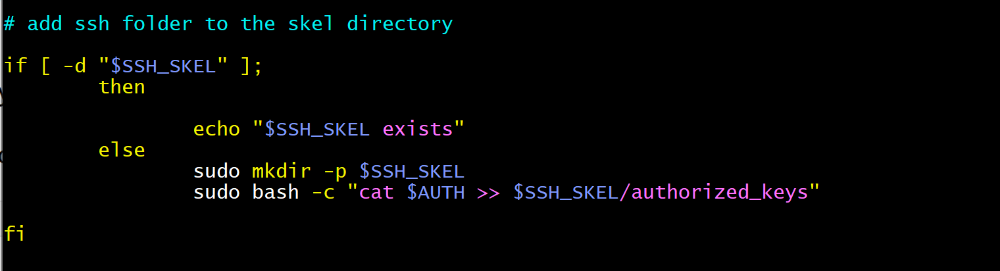

## For each user also ensure that an authourized key file must be created in the .ssh folder created above and the publick key is copied to the file and the file will recide in the etc/skel/.ssh directory

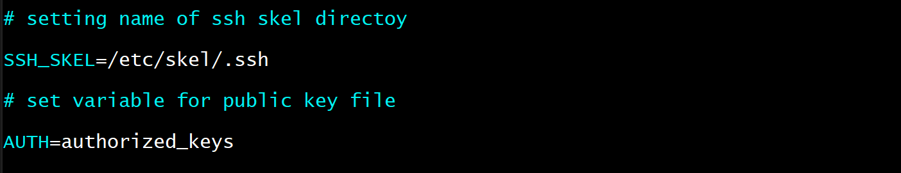

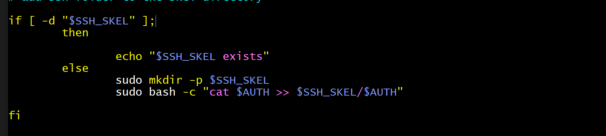

## scp to the AWS VM and drop the written script using the sysntax in the picture below

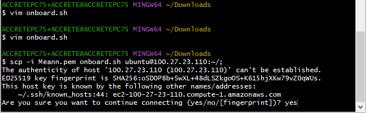

## create id_rsa and id_rsa.pub files in shell folder

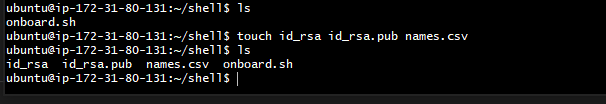

# test run the script using sudo priveledges 

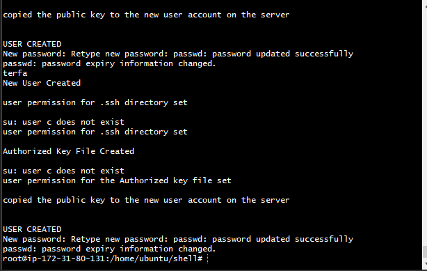

## we can view the created users using the ls - /home/ and we can also check the created group developers and also check the id of users using entent

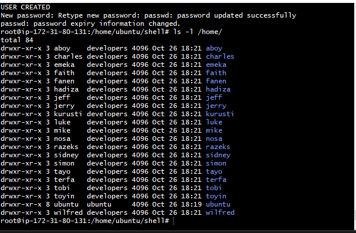

## check a sample of the onboard user script below

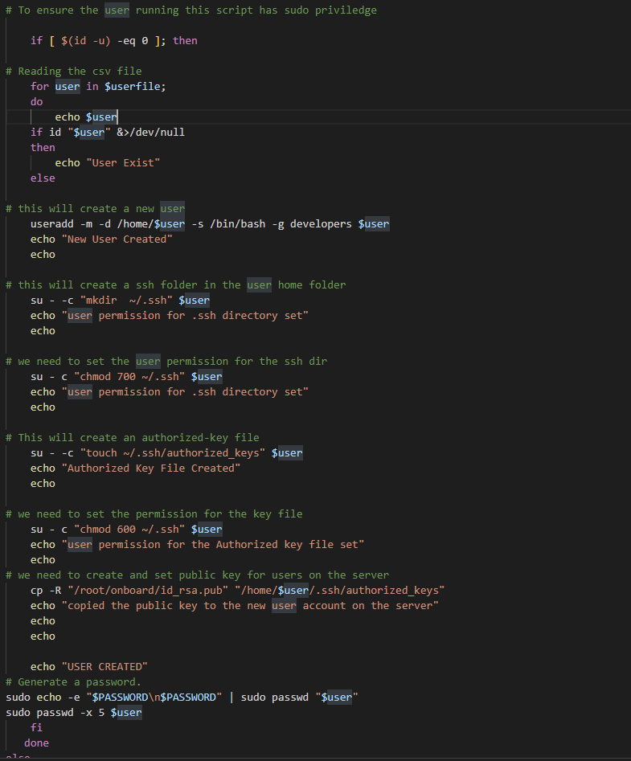

## we can now test using the public and private key to see if we can connect to the server

